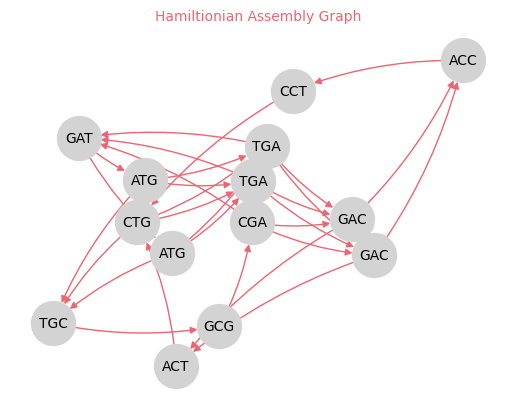

# Genome assembly through Graph theory 

Genome Assembly is one of the biggest bioinformatics problems aiming to generate process and generate genomic data from sequenced DNA. It is still tackled by researchers, _Assemblethon_ is a widely known competition to compare different genome assembly algorithms and their performance.

_What's Genome Sequencing?_  
It's the process of determining the DNA sequence of an organism's genome, base pair by base pair. The origins of sequencing trace back to the 1970s with the first generation _Sanger sequencing_ method. Sequencing and bioinformatics have evolved in tandem, with the development of new sequencing technologies and algorithms to process the large amount of generated data. The Human Genome Project was a major milestone in the field, it startd in 1990 with the aim of sequencing a full human genome, it took 13 years and cost around 3 billion dollars, rate of 1 $/bp.  
Second generation sequencing like Illumina have appeared ~2005 and the cost has dropped significantly since then. This has allowed high-throughput sequencing and the generation of large amounts of data, relying on "short-read" sequencing.   Third generation sequencing like PacBio and Nanopore have appeared more recently, with the ability to generate long reads, which can solve some caveats of short-read sequencing.  
The main methodology that all appraches agree on is to break the genome into small fragments, and sequence them. Thus, as an output, we will get a set of "reads" which are these fragments of the genome, that have been sequenced.

_What's Genome Assembly?_
Process of reconstructing the original genome from the reads. It heavily relies on overlap between reads to find the correct order of the reads. 


**Problem Statement**:  
Given a set of reads, we want to reconstruct the original genome from which the reads were generated. This is a combinatorial optimization problem, and it's NP-hard.   
The original idea is to construct a graph representation of the reads, relying on _k-mers_ (substrings of length k) to find overlaps between reads. First, an intuitive approach is to construct a graph to visualize this overlap: k-mers are nodes, edges are overlaps. The overlap can be with several k-mers: `TGC` with `TGT` and   all have an overlap of 2. Inside this graph there is the full sequence, following node-edge-node-edge we would end up with the full sequence: find a path that will go through all nodes at once: **Hamiltonian path**, it's NP-hard.   
But this approach allowed another visualization of the problem, leading a simpler formulation: instead of having k-mers as nodes, we use them as edges, and the overlap between them (k-1 mers) as nodes. Hence, we can find a path that goes through all edges once: **Eulerian path**, which is the same problem that was described by Euler in "_Bridges of Königsberg_" (1736)  leading to the development of graph theory.  
<p align='center'>

</p>

The Eulerian cycle is a path that goes through all edges of a graph once and only once, and ends up in the same node, however unlike the Hamiltonian path, it can pass through vertices several times. Solving it is doable in polynomial time, and it's the key used in many genome assembly algorithms to solve the problem.
The graph that represents the reads is called the _De Bruijn graph_, and the Eulerian path in this graph will give us the original genome.

In this repository we will explore the construction for both types of graphs. Although the main focus will be on the De Bruijn graph and the Eulerian path, it would be interesting to try metahuristic algorithms to solve the Hamiltonian path problem in an approximate way.


## De Bruijn Graph
De Bruijn Graph is a directed graph that represents overlaps between k-mers (k-mers as edges). Used to reconstruct genome from Eulerian path. It provides an exact solution through _Hierholzer's algorithm_.


<!-- The algorithm to find a $Eulerian$ $path$ in a graph is called $Hierholzer's$ $algorithm$. The main steps to follow:  
1. Verification that the path actually exists (as discussed previously)   -->


<!-- $Hierholzer's\ algorithm(G):$  
$V, E \leftarrow G$ -->

> [!IMPORTANT]
If an exact solution of the Eulerian path exists and is solvable in polynomial time, why is it still an open problem in genome assembly? 
The main issue lies with the sequenced reads. Ideally, we would get the correct sequence of all the fragments we have initially created from the whole genome, so we would get one perfectly reconstructed sequence. However that's never the case, we always end up with several assembled "contigs", which is later complemented with other scaffolding approaches to fill in gaps and get the genome.  
Let alone the fact that we have a percentage error for each bp sequenced, many reads might not show overlap, failing to reconstruct the fragments as they were. Finding overlaps is especially problematic while dealing with repeats, like `AGAGAGAGAAGA` where the overlap is not unique. To make the assembly results more accurate, we consider starting off with a large k value, however this raises the complexity of the problem and makes it harder to find overlaps. It's always gonna be a trade-off

## Hamiltonian Assembly Graph

This graph that has k-mers as nodes and overlap as edges, solved by the Hamiltonian path problem. We will refer to it as the Hamiltonian Assembly Graph (HAG).

* nodes: k-mers (duplicate nodes allowed)
* edges: overlaps
* Graph: directed

It will be a digraph (inherits `nx.DiGraph`), as overlaps can be in both directions. Most importantly, we will allow for duplicate **nodes**, and that's through the implementation of a `Kmer` class that will allow to have unqiue instances of 2 identically sequenced k-mers (not to lose the multiplicity, it's a very important design step). We do not care for edge multiplicity, as we only need to know if there is an overlap or not (binary relationship). From here we can see some differences in class implementation with DBG, in addition to the formal definition of nodes and edges.


## Demo

Python libraries enlisted in [`requirements.txt`](./requirements.txt) file.  
<!-- To use `graphviz` to visualize the graph, you need to install this if you're on conda:
```bash
conda install -c anaconda python-graphviz
```
Or else install it on ubuntu:
```bash
sudo apt-get install graphviz
``` -->

To build a hamiltonian assembly graph, you can use the following code:
```bash
python src/HAG.py
```
Which will try building a graph from 3-mers the form the dna string `ATGCGATGACCTGACT`, following this example:
```python
>>> dna_string = "ATGCGATGACCTGACT"
>>> k = 3
>>> a=split_into_kmers(dna_string, k)
>>> g=HAGraph(a)
>>> print(g)
kmers       14
overlaps    29
dtype: int64
Hamiltionian Assembly Graph
```
<p align='center'>

</p>

## References  
* [Eilliam Fiset youtube playlist](https://www.youtube.com/watch?v=8MpoO2zA2l4) for graph theory - particulalry Eulerian path and Hierholzer's algorithm  

[MIT License](./LICENSE)